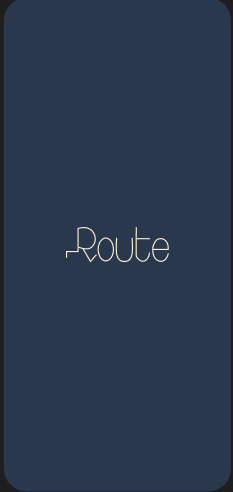
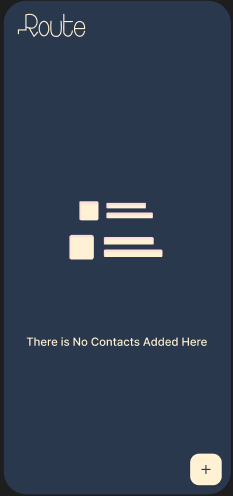
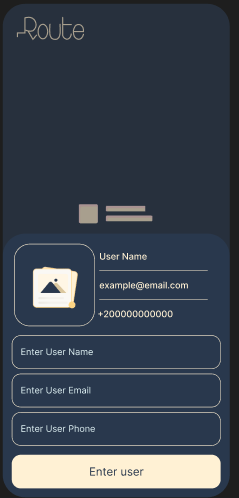
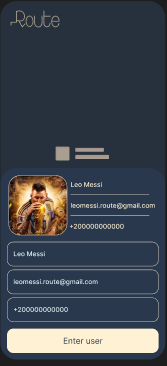
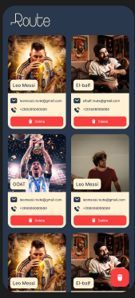

# Space Contact App 🚀

A sleek and responsive Flutter application for managing contacts, designed with a focus on UI/UX and field validation.

## 📸 Preview
The app allows users to add up to 6 contacts with their personal information and images, featuring a modern dark-blue and gold theme.

## ✨ Features
- **Add Contacts**: Input Name, Email, Phone, and select a profile picture.
- **Live Preview**: See your data update in real-time as you type in the bottom sheet.
- **Form Validation**:
    - Name: Minimum 6 characters.
    - Email: Standard email format validation.
    - Phone: Egyptian phone number format (starts with 01...).
- **Responsive Design**: Powered by `flutter_screenutil` to look great on all devices.
- **Dynamic List**: Interactive GridView to display contacts with the ability to delete individual items.
- **Animations**: Integrated Lottie animations for empty states and image picking.

## 🛠 Tech Stack
- **Framework**: [Flutter](https://flutter.dev)
- **State Management**: Static List Management.
- **Libraries**:
    - `flutter_screenutil`: Responsive UI.
    - `lottie`: High-quality animations.
    - `image_picker`: Accessing gallery for profile photos.

## 📸 Screenshots

  
  
  
  
  
  

## 🚀 Getting Started

### Prerequisites
- Flutter SDK installed.
- Android Studio / VS Code.

